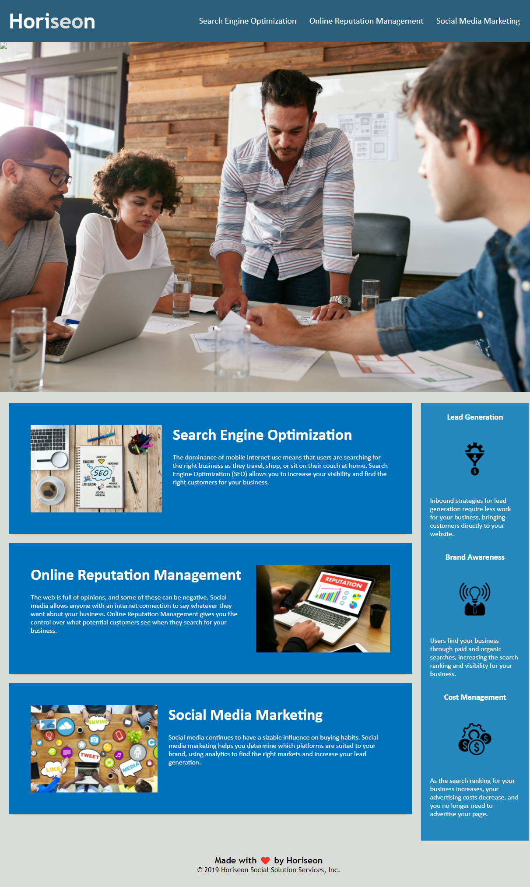

# Horiseon Semantic Code Refactorning

## Objectives

Refactor the generic HTML code provided into semantic HTML code while also trying to achieve the following objectives:
- ensuring the site has a logical and understandable structure
- ensuring the website meets accesibility standards 
- ensuring everything on the site functions properly
- conosolidating the CSS selectors and properties for increased efficiency

## Main Changes

- Changed website title from "website" to "Horiseon Digital Marketing"
- Changed div with class="header" to header element
- Changed div with unordered list to nav element with li element
- Changed div with class="hero" to figure element
- Changed div with class="content" to main element
- Made the three div elements within the main element to section elements
- Added id="search-engine-optimization" to first section in order to fix the search-engine-optimization link
- Changed div with class=beneftits to aside element
- Made div with classes benefit-leads, benefit-brands, and benefit-cost sectiion elements instead
- Consolidated benefit-leads, benefit-brands, and benefit-cost class into class=benefit-lbc
- Added alt attribute with descriptions to images
- Changed div with class="footer" to footer element

## Screenshot

## Link

[Link to final webpage](https://emily-mvaz.github.io/semantic-html/)

## Contributions

I used information and tutorials from [W3schools](https://www.w3schools.com/html/html5_semantic_elements.asp) regarding semantic elements.

I also recieved help from Eugene, Gustavo and Kelly helping me look over my code.
